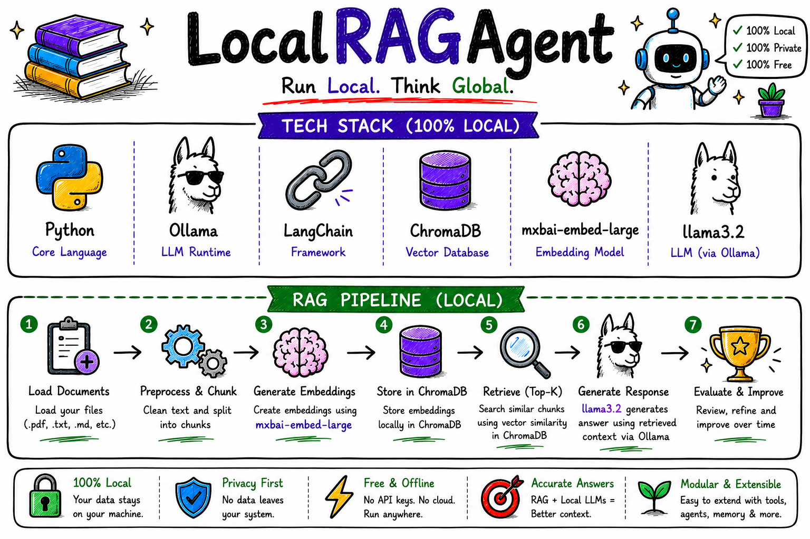

# localRAGAgent
A fully local Retrieval-Augmented Generation (RAG) AI agent built with Ollama, LangChain, and ChromaDB.
# LocalRAGAgent

> **Build and run a fully local Retrieval-Augmented Generation (RAG) AI agent using Python, Ollama, LangChain, and ChromaDB — completely offline, private, and free.**

<p align="center">
  
</p>

---

## Overview

**LocalRAGAgent** demonstrates how to build an AI assistant that can answer questions from your own documents without relying on cloud APIs.

The project leverages **Ollama** to run Large Language Models locally, **LangChain** for orchestration, **ChromaDB** for vector storage, and **mxbai-embed-large** for embedding generation. Your documents are converted into embeddings, stored locally, and retrieved whenever the model needs additional context to answer a query.

Everything runs on your own machine, ensuring complete privacy while eliminating API costs.

---

## Features

- Local LLM inference using **Llama 3.2**
- Local embeddings with **mxbai-embed-large**
- LangChain-powered RAG pipeline
- ChromaDB vector database
- PDF document ingestion
- Semantic similarity search
- Context-aware AI responses
- 100% Local & Private
- No API Keys Required
- Fast Retrieval

---

## Tech Stack

| Technology | Purpose |
|------------|---------|
| Python | Core Programming Language |
| Ollama | Local LLM Runtime |
| Llama 3.2 | Language Model |
| mxbai-embed-large | Embedding Model |
| LangChain | RAG Framework |
| ChromaDB | Vector Database |
| PyPDF | PDF Processing |

---

## RAG Pipeline

<p align="center">
  
</p>

The complete workflow follows these steps:

1. Load Documents
2. Preprocess & Chunk
3. Generate Embeddings (`mxbai-embed-large`)
4. Store Embeddings in ChromaDB
5. Retrieve Relevant Chunks
6. Generate Response using **Llama 3.2**
7. Return Context-Aware Answer

---

## Installation

Clone the repository.

```bash
git clone https://github.com/<your-username>/LocalRAGAgent.git
```

Move into the project directory.

```bash
cd LocalRAGAgent
```

Install the required packages.

```bash
pip install -r requirements.txt
```

Make sure the following Ollama models are installed.

```bash
ollama pull llama3.2
ollama pull mxbai-embed-large
```

---

## Run

Simply start the application by running:

```bash
python main.py
```

That's it!

---

## Why LocalRAGAgent?

- Complete Privacy
- Runs Entirely Offline
- No Cloud Dependencies
- Zero API Costs
- Bring Your Own Documents
- Fast Local Inference
- Easy to Extend

---

## Future Improvements

- Multi-document support
- Conversation memory
- Streaming responses
- Hybrid search
- Metadata filtering
- Multi-agent workflows
- Web interface with Streamlit
- Support for additional local LLMs

---